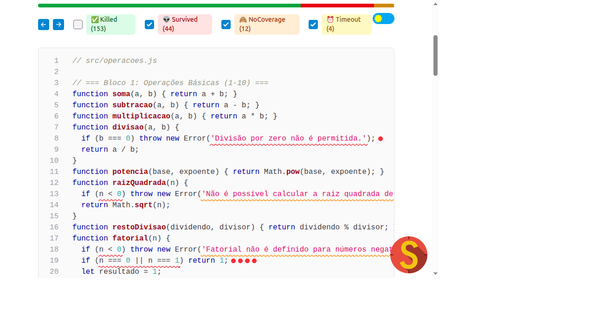
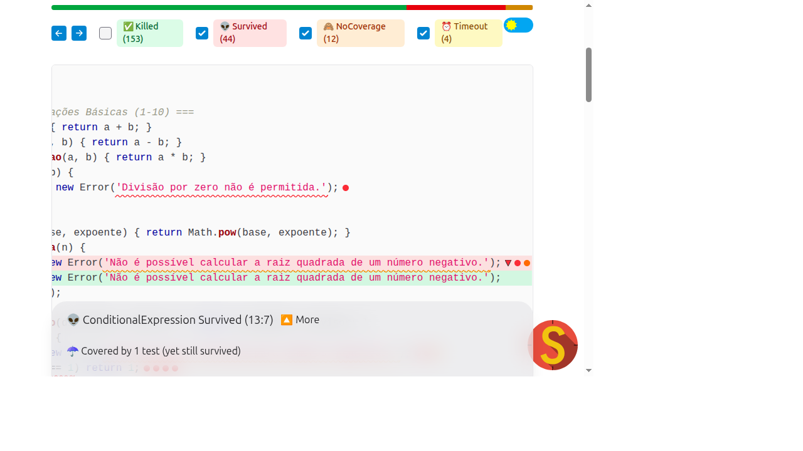

# Relatorio de Teste de Mutacao

## Capa

Disciplina: Testes de Software

Trabalho: Teste de Mutacao

Aluno: Erica Alves dos Santos

Matricula: 799648

Data: 10 de maio de 2026

---

## Analise Inicial

### Cobertura de codigo (inicial)

Resultado do `npm test` com cobertura:

- Test suites: 1 passed, 1 total
- Tests: 50 passed, 50 total
- Time: 0.767 s

Resumo da cobertura:

- % Stmts: 85.41%
- % Branch: 58.82%
- % Funcs: 100%
- % Lines: 98.64%
- Linhas nao cobertas: 112

### Pontuacao de mutacao (inicial)

Pontuacao de mutacao inicial: 73.71% (primeira execucao do Stryker).

### Discrepancia entre cobertura e mutacao

A cobertura de linhas esta muito alta (98.64%), mas a pontuacao de mutacao ficou bem menor (73.71%). Isso indica que os testes exercitam o codigo, mas nao garantem que o comportamento esteja correto em casos de borda. Em outras palavras, os testes passam mesmo quando o codigo sofre alteracoes logicas sutis (por exemplo, trocar um comparador ou remover uma condicao).

---

## Analise de Mutantes Criticos (Primeira Execucao)

Foram escolhidos dois mutantes sobreviventes relevantes:

### Mutante 1: Divisao por zero (mensagem de erro)

- Arquivo: src/operacoes.js
- Mutacao: a mensagem do erro foi trocada por string vazia.
- Impacto: o teste original verificava apenas se um erro era lancado, mas nao validava a mensagem.

Screenshot do relatorio:

**Por que sobreviveu?**

O teste existente era:

- `expect(() => divisao(5, 0)).toThrow()`

Esse teste passa mesmo que a mensagem de erro seja alterada. Assim, o mutante sobreviveu porque a assercao nao era especifica o suficiente.

### Mutante 2: Raiz quadrada de numero negativo

- Arquivo: src/operacoes.js
- Mutacao: a condicao `if (n < 0)` foi substituida por `if (false)`.
- Impacto: o erro nunca seria lancado para valores negativos.

Screenshot do relatorio:

**Por que sobreviveu?**

O teste original cobria apenas um valor positivo (16). Nao havia caso negativo, entao a alteracao da condicao nao causava falha no teste.

---

## Solucao Implementada

Foram adicionados testes de borda para matar os mutantes analisados:

1) **Divisao por zero**

- Novo teste valida a mensagem de erro:
  - `expect(() => divisao(5, 0)).toThrow('Divisao por zero nao e permitida.')`

Esse teste falha quando a mensagem eh trocada por `""`, eliminando o mutante.

2) **Raiz quadrada negativa**

- Novo teste cobre valor negativo:
  - `expect(() => raizQuadrada(-1)).toThrow('Nao e possivel calcular a raiz quadrada de um numero negativo.')`

Com isso, a mutacao que remove a condicao passa a ser detectada.

Esses novos testes sao eficazes porque verificam comportamento esperado e mensagens especificas, evitando falsos positivos na cobertura.

---

## Resultados Finais

Pontuacao de mutacao final: 98.07%.

A melhora foi significativa: de 73.71% para 98.07%, indicando que a suite de testes ficou mais robusta e sensivel a erros logicos.

---

## Conclusao

O teste de mutacao mostrou que cobertura alta nao garante qualidade de testes, ao introduzir falhas artificiais, o Stryker revelou lacunas que nao eram visiveis com cobertura tradicional e a aplicacao dessa tecnica levou a testes mais precisos, cobrindo casos de borda e validando comportamento correto. Portanto, o teste de mutacao eh uma ferramenta essencial para avaliar a efetividade real de uma suite de testes.
